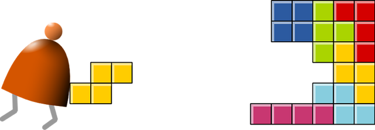
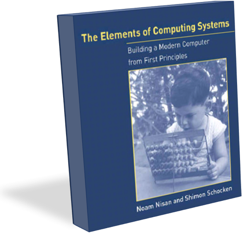

# Nand-to-Tetris
Project solutions for the Nand to Tetris course.

## Solution of The Elements of Computing Systems
This repository contains my solutions to the projects for **[Nand to Tetris](http://www.nand2tetris.org)** course by Noam Nisan and Shimon Schocken. It's a fantastic course and I highly recommend it. Also, you should definitely check out the [book](https://www.amazon.com/Elements-Computing-Systems-Building-Principles/dp/0262640686/ref=ed_oe_p) as well.

